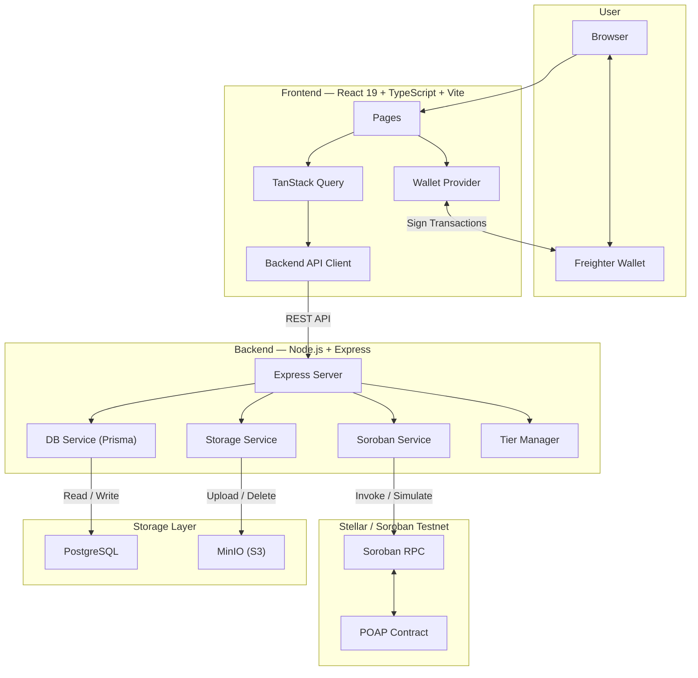
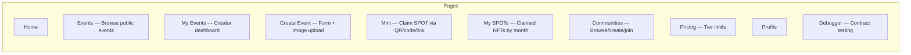
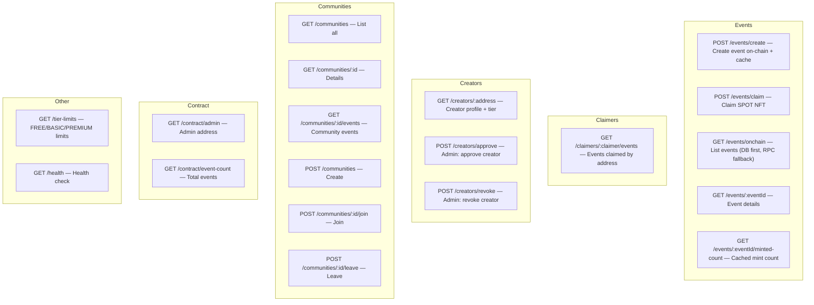
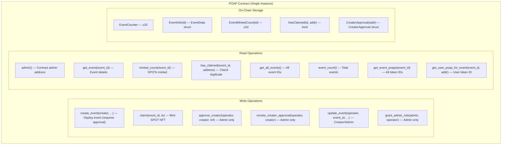
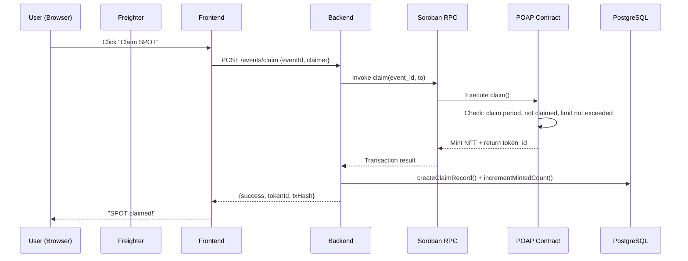
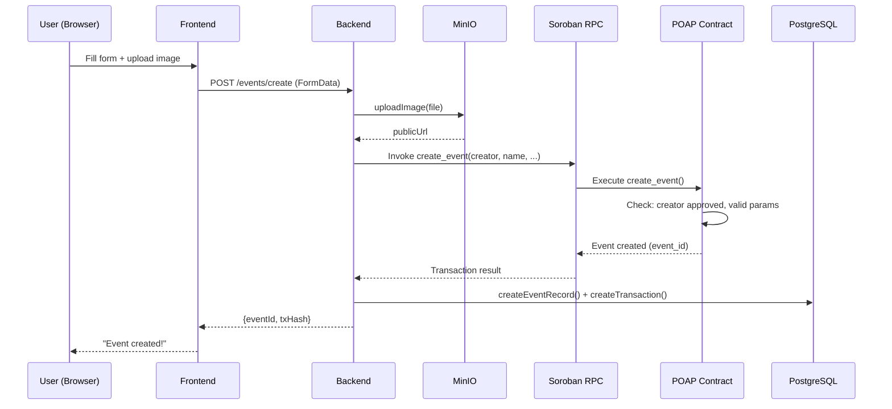
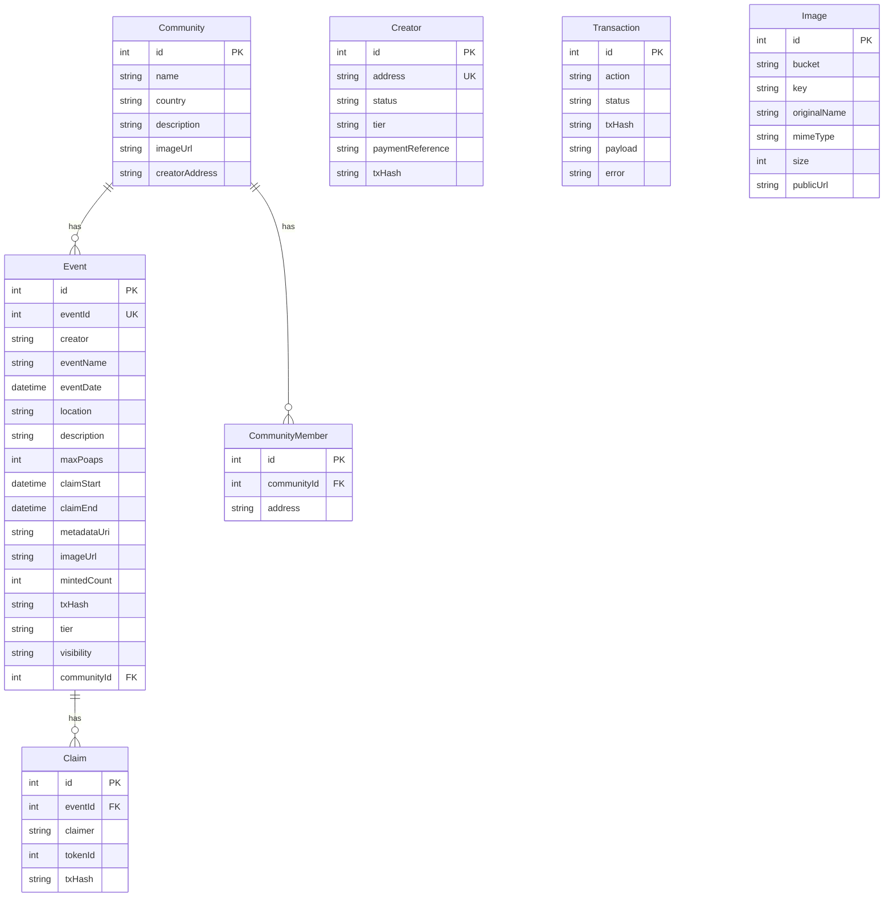
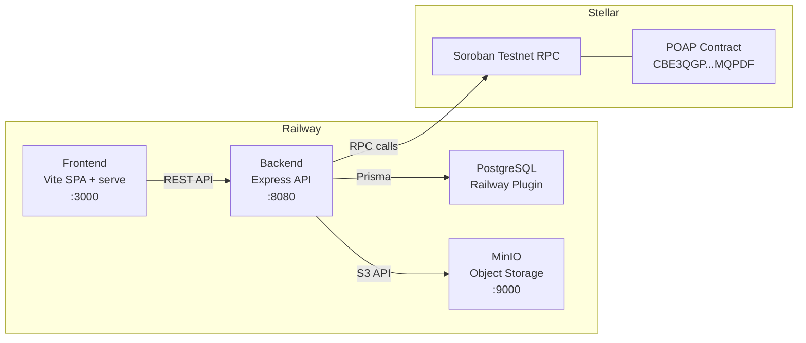

# SPOT — Technical Architecture

## System Overview

## Frontend Pages

## Backend API Endpoints

## Smart Contract — POAP (Active)

## Data Flow — Claim SPOT

## Data Flow — Create Event

## Database Schema

## Infrastructure — Production

## Key Architectural Patterns

| Pattern | Description |
|---------|-------------|
| Single Contract | All events managed in one `poap` contract instance with event IDs |
| Hybrid Storage | Essential data on-chain, images in MinIO, cache in PostgreSQL |
| DB-First Caching | Backend tries PostgreSQL first, falls back to Soroban RPC if empty |
| Role-Based Access | On-chain admin/creator roles + off-chain tier-based limits |
| Approval Workflow | Creators approved by admin (payment), stored on-chain |
| Dual Validation | On-chain (limits, duplicates, permissions) + off-chain (tiers, rate limiting) |
| Tier Limits | FREE: 5 SPOTs/event, 3 active — BASIC: 100/10 — PREMIUM: unlimited |
